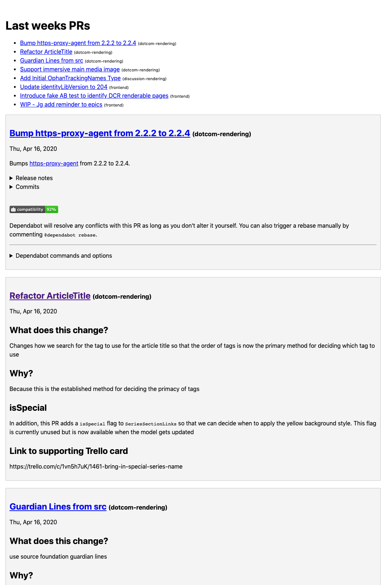

# Github Get

## Run

```
node cron.js
```

Will run immediately, generating `email.html` and then, if running, will regenerate periodically (look in cron.js).

## Different Repos

Edit the repos array in cron.js

## Screenshot

